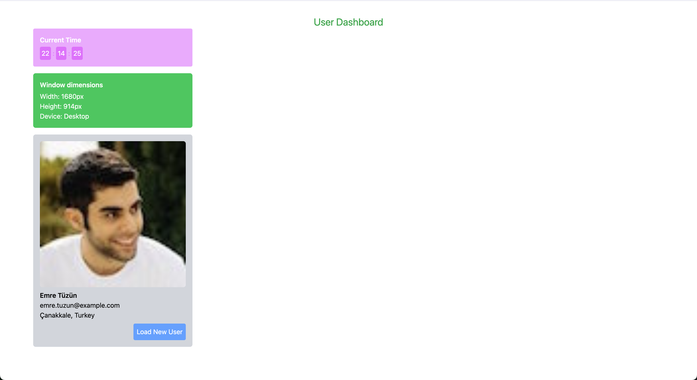

# UseEffect Challenge 1: User Dashboard



## Problem Statement

Build a **User Dashboard** that demonstrates multiple useEffect patterns and cleanup mechanisms.

## Requirements

The dashboard should display:

1. **Auto-updating Clock**
   - Show current time that updates every second
   - Format: HH:MM:SS or custom format
   - Clean up interval on unmount

2. **Window Dimensions Tracker**
   - Display current window width and height
   - Update dimensions on window resize
   - Show device type indicator (Mobile < 768px, Tablet < 1024px, Desktop ≥ 1024px)
   - Clean up resize event listener on unmount

3. **Random User Card**
   - Fetch and display user data from `https://randomuser.me/api/`
   - Show user avatar, name, email, and location
   - Include a "Refresh" button to load a new random user
   - Handle loading and error states
   - Implement request cancellation using AbortController

## Learning Objectives

- Multiple useEffect hooks in one component
- Cleanup functions for timers and event listeners
- API calls with proper error handling
- Request cancellation to prevent memory leaks
- Conditional rendering based on loading/error states

## API Endpoint

```
GET https://randomuser.me/api/
```